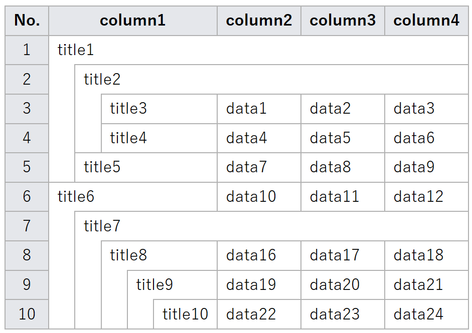
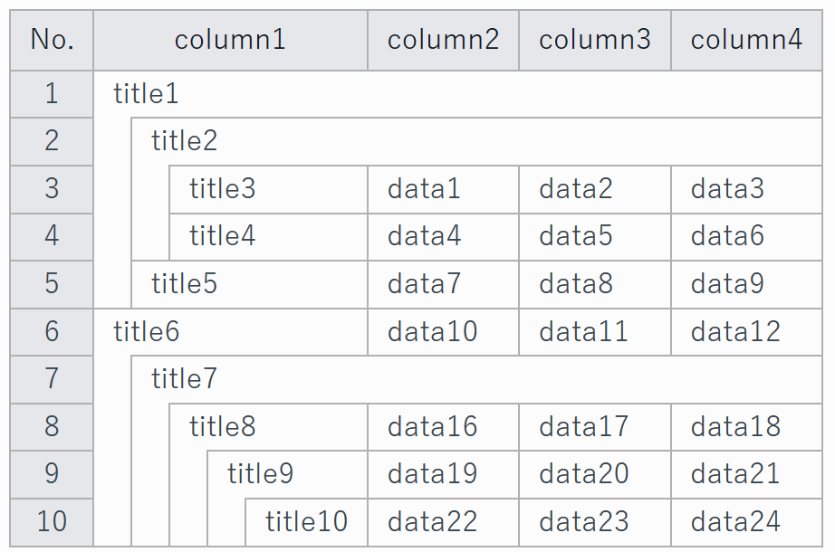

# PureNestTable

- [PureNestTable](#purenesttable)
  - [What is PureNestTable?](#what-is-purenesttable)
  - [Usage](#usage)
    - [Usage example](#usage-example)
  - [When using with Mkdocs](#when-using-with-mkdocs)
    - [Mkdocs environment configuration](#mkdocs-environment-configuration)
    - [Usage example when using with Mkdocs](#usage-example-when-using-with-mkdocs)
  - [License](#license)


## What is PureNestTable?

PureNestTable is a JavaScript library that converts a nested list to a table.

## Usage

### Usage example


``` js
const markdown = `
- column1                 | column2 | column3 | column4 
- title1                                                
    - title2                                            
        - title3          | data1   | data2   | data3   
        - title4          | data4   | data5   | data6   
    - title5              | data7   | data8   | data9
- title6                  | data10  | data11  | data12
    - title7              
        - title8          | data16  | data17  | data18
            - title9      | data19  | data20  | data21
                - title10 | data22  | data23  | data24
`;

try{
    const tableHtml  = NestTable.parseMarkdown2Html(markdown);
    document.getElementById('nest-table').innerHTML = tableHtml;
}catch(e){
    console.error(e);
}

```




## When using with Mkdocs

### Mkdocs environment configuration

Add the following to mkdocs.yml.


``` yml
markdown_extensions:
- pymdownx.superfences:
    custom_fences:
        - name: mkdocs-nest-table
          class: mkdocs-nest-table
extra_javascript:
- https://yu-ki-m.github.io/PureNestTable/src/mkdocs/mkdocs-nest-table.js
extra_css:
- https://yu-ki-m.github.io/PureNestTable/src/mkdocs/mkdocs-nest-table.css
```


### Usage example when using with Mkdocs

``` md
    ``` mkdocs-nest-table
    - column1                 | column2 | column3 | column4 
    - title1                                                
        - title2                                            
            - title3          | data1   | data2   | data3   
            - title4          | data4   | data5   | data6   
        - title5              | data7   | data8   | data9
    - title6                  | data10  | data11  | data12
        - title7              
            - title8          | data16  | data17  | data18
                - title9      | data19  | data20  | data21
                    - title10 | data22  | data23  | data24
    ```
```



## License

[MIT](LICENSE)


